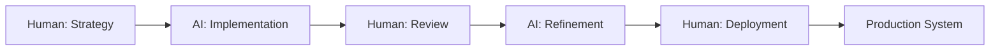

# 🤖 Klement Gunndu × AI // Building the Future

<div align="center">

```ascii
╔═══════════════════════════════════════════════════════════════╗
║                                                               ║
║     HUMAN + AI COLLABORATION → EXPONENTIAL PRODUCTIVITY       ║
║                                                               ║
╚═══════════════════════════════════════════════════════════════╝
```

[](https://github.com/KlementMultiverse)
[](https://github.com/KlementMultiverse)
[](https://github.com/KlementMultiverse)

</div>

---

## 🧠 The Philosophy: Human × AI = 10x Output

I don't just *use* AI—I **collaborate** with it.

Every project you see here is built through **human-AI partnership**:
- 🤖 AI handles repetition, boilerplate, research
- 🧠 I handle strategy, architecture, creativity
- ⚡ Together we build in days what takes others months

**Result:** 15+ production-ready projects. All automated. All open source.

---

## 🚀 What I Build

### Multi-Agent AI Systems
Building intelligent systems where multiple AI agents collaborate to solve complex problems.

```python
# My approach to every project
def build_with_ai():
    while True:
        idea = human_creativity()
        design = human_architecture()
        code = ai_generation(design)
        review = human_validation(code)
        if review.approved:
            deploy_to_production()
```

### Current Focus Areas
- 🤖 **Agentic AI**: Multi-agent systems with reasoning capabilities
- 🏗️ **DevOps Automation**: Infrastructure as code, CI/CD at scale
- 📊 **Production Systems**: Tools that solve FAANG-level problems
- 🔮 **Future Tech**: Building what doesn't exist yet

---

## 💼 The Work

### ⚡ 15 Production-Grade Repositories
Every repo includes:
- ✅ Docker containerization
- ✅ Full CI/CD pipelines
- ✅ Comprehensive documentation
- ✅ Automated testing
- ✅ One-command deployment

All built through **human-AI collaboration** in record time.

### 🎯 Real Problems Solved
- Multi-agent automation systems
- RAG (Retrieval-Augmented Generation) implementations
- Customer support AI agents
- API documentation generators
- Production monitoring tools

---

## 🛠️ Tech Stack

### Core Technologies
```yaml
AI/ML:
  - Multi-Agent Frameworks
  - LangChain, LlamaIndex
  - OpenAI, Anthropic Claude
  - RAG Systems
  - Vector Databases

Backend:
  - Python (Expert)
  - FastAPI, Flask
  - PostgreSQL, MongoDB
  - Redis, Celery

DevOps:
  - Docker, Kubernetes
  - GitHub Actions
  - AWS, GCP
  - Terraform

Architecture:
  - Microservices
  - Event-Driven Systems
  - SOLID Principles
  - Clean Architecture
```

---

## 📊 GitHub Stats

<div align="center">


</div>

---

## 🎓 The Learning Philosophy

```
┌─────────────────────────────────────────────────────────┐
│                                                         │
│  "I don't learn to know—I learn to build."             │
│                                                         │
│  Every technology I learn immediately becomes           │
│  a production project.                                  │
│                                                         │
│  Theory → Practice → Production → Repeat                │
│                                                         │
└─────────────────────────────────────────────────────────┘
```

**How I Learn:**
1. Research trending technology
2. Build production implementation
3. Document everything
4. Open source it
5. Move to next challenge

**Result:** Constant growth + portfolio of real systems

---

## 🌟 Featured Projects

### 🤖 Master Automation Center
Multi-agent AI system that automates my entire workflow.
- 11 automation modules
- Blog generation + publishing
- GitHub automation
- Security scanning
- All coordinated by AI

**Tech:** Python, Multi-Agent Systems, GitHub API, Publishing APIs

---

### 🔍 Production Log Analyzer (Coming Soon)
AI-powered tool that analyzes production logs and finds root causes automatically.
- Real-time log analysis
- AI pattern detection
- Root cause identification
- Beautiful terminal UI

**Tech:** Python, AI/ML, Terminal UI, Pattern Recognition

---

### 📚 RAG Microservices
Production-ready Retrieval-Augmented Generation system.
- Microservices architecture
- Vector search
- LLM integration
- Full documentation

**Tech:** Python, LangChain, Vector DB, Microservices

---

## 💡 The Collaboration Model

### How Human-AI Partnership Works



**What I Do:**
- Define architecture
- Make strategic decisions
- Validate outputs
- Ensure quality
- Deploy to production

**What AI Does:**
- Generate boilerplate
- Write documentation
- Create tests
- Suggest optimizations
- Handle repetitive tasks

**Together:** Build production systems in days, not months.

---

## 🎯 Currently Working On

🚀 **Building FAANG-Level Projects**
- Production systems that solve real problems
- Tools that would be useful at Netflix, Uber, Google scale
- Open source, well-documented, production-ready

📝 **Writing Technical Content**
- Sharing the human-AI collaboration model
- Publishing on Dev.to, Hashnode, Medium
- Documenting everything I build

🌐 **Growing Open Source Presence**
- Contributing to community
- Helping others learn
- Building in public

---

## 📫 Let's Connect

I'm **open to opportunities** where AI and automation can solve real problems at scale.

### Interested In:
- 🤖 **AI/ML Engineering** roles
- ⚡ **DevOps/Platform Engineering** positions
- 🚀 **Full-Stack** roles with AI focus
- 💼 **Freelance/Contract** projects
- 🤝 **Open Source** collaborations

### Reach Me:
- 💼 [LinkedIn](https://www.linkedin.com/in/klement-gunndu-601872351)
- 🌐 [Portfolio](https://klementmultiverse.github.io)
- 📧 klementgunndu.singularity@gmail.com

---

## 🔥 The Mission

**Building the future where humans and AI collaborate seamlessly.**

Every project here demonstrates that **human creativity + AI capability = exponential results**.

I'm not replacing human work with AI—I'm **amplifying** it.

---

<div align="center">

### ⭐ Star my projects if you find them useful!

```ascii
╔═══════════════════════════════════════════════════════════╗
║                                                           ║
║  "The future belongs to those who learn to collaborate   ║
║   with AI, not compete against it."                      ║
║                                                           ║
║                               - Building that future now  ║
║                                                           ║
╚═══════════════════════════════════════════════════════════╝
```


</div>

---

<sub>🤖 This profile README itself was collaboratively created through human-AI partnership. Meta, right?</sub>
